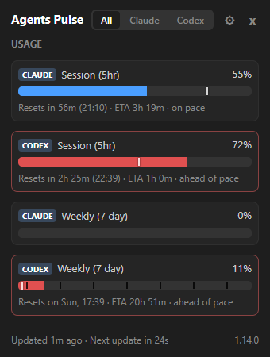
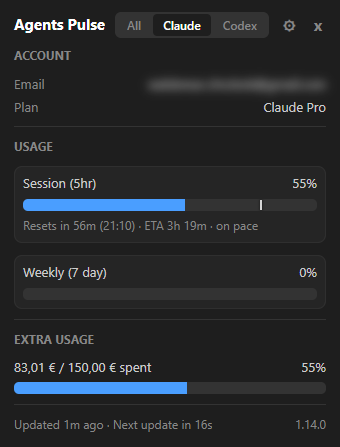
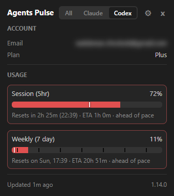

# Agents Pulse

Monitor Claude, Codex, and Kimi API usage from your Windows system tray. See at a glance how much of your session and weekly quota you've used, get desktop alerts before you run out, and automate actions when quotas reset.

## Screenshots







## Features

### Getting started

- **Portable** - a single `.exe` file, no installer. Copy it anywhere and run it.
- **Zero configuration** - works immediately after logging in to Claude Code. No API keys to copy, no settings to fill in.

### Daily visible value

- **Live tray icon** - one bar per provider shows current Claude, Codex, and Kimi session usage directly in the taskbar (or rings, or your highest percentage as a number) and adapts to your taskbar's light or dark theme. When every provider is at its limit, the icon counts down to the reset and shows a check mark the moment you can work again.
- **Detail popup** - left-click the icon to see a polished breakdown of every quota type (session, weekly, per-model variants, paid overage), each with its status, a lighter segment projecting usage to the reset, and the time until it resets, plus your account email and plan. Buttons open the dashboard or fetch fresh data.
- **Claude Code status line** - see your session and weekly usage right below the Claude Code prompt, with the time the session resets and a colored warning when a quota is tight or about to run out. The dashboard shows the one entry to paste into `~/.claude/settings.json`, and the line comes from the app's latest reading, so it never adds API requests.
- **Claude Code versions** - the popup footer shows the Claude Code CLI version and any IDE extension versions (VS Code, Cursor, Windsurf), so you always know what's installed.

### Proactive protection

- **Forecasts** - every quota tells you whether it lasts until its reset: **On track**, **Tight**, or **Limit ~15:47** when it will run out first. Sessions are projected from their current pace and weekly limits from your own past weeks, so a busy morning is not mistaken for a week that runs out. Like a weather forecast, a quota heading for its limit also tells you the range it will most likely run out in and how long you would be without quota: **Limit ~15:47 (15:20-16:30)**.
- **Daily budget** - know how much of your weekly quota today may use so it lasts until the reset, such as "Today: 12 of 27 pp", spread over your own workdays; the popup warns once today goes over its share.
- **Smart alerts** - Windows desktop notifications fire when you cross configurable thresholds (e.g. 50%, 80%, 95% for the session; 95% for the weekly quota). Time-aware mode suppresses alerts when your pace is still within budget, reducing noise.
- **While you were away** - come back to one notification that sums up your absence: which quotas reset and how much your agents used in the background, instead of a stack of alerts held back while the screen was locked.
- **Quiet hours** - defer all desktop notifications during a configured time window (e.g. overnight) so you aren't woken by alerts.
- **Event commands** - run any shell command automatically when a quota resets or a threshold is crossed. Use this to resume a Claude Code session the moment your session quota refreshes, send a Slack message, or check for app updates. Commands run silently in the background without stealing focus.

### Visual quality

- **Local dashboard** - open a browser dashboard (localhost) from the tray menu or the popup. It starts with a one-line summary and a card per provider with every quota's status and forecast, followed by usage history across 24h, 7d, or 30d in session and weekly panels with a crosshair tooltip and a data table, this week drawn against your typical week so a heavier week than usual stands out before it runs out, your session windows of the last week with the time you spent at a limit and when a first message would move the reset to when you usually run out, consumption bars that count each piece of work once, a weekday-by-hour heatmap of when you use the most, and a CSV export. History is stored locally (quota percentages only, never tokens or account data) and survives restarts. The dashboard follows your system light/dark theme, is shown in your language, and has a slide-out settings panel for alerts, the tray icon style, autostart, and display options.

### Reliability

- **Automatic token refresh** - when your Claude Code OAuth token expires, the app refreshes it silently via the Claude Code CLI. You never need to restart or re-authenticate manually.
- **Adaptive polling** - polling speeds up automatically when usage is actively increasing and slows down when you're idle or the workstation is locked, keeping network traffic low without missing events.

### Reach and preferences

- **13 languages** - English, German, Spanish, French, Hindi, Indonesian, Italian, Japanese, Korean, Portuguese (Brazil), Ukrainian, Simplified Chinese, Traditional Chinese, across the tray, popup, and dashboard. Language is auto-detected from your system locale.
- **Codex and Kimi support** - tracks OpenAI Codex and Kimi For Coding usage alongside Claude whenever their CLI login state is present, each with its own tab, thresholds, and history.
- **Customizable** - adjust polling intervals, alert thresholds, popup colors, which quota fields appear in the icon, tooltip, and Claude Code status line, and more via a JSON settings file or the dashboard settings panel.

## Requirements

- Windows 10 or later
- [Claude Code](https://claude.ai/code) installed and logged in
- [Microsoft Edge WebView2 Runtime](https://developer.microsoft.com/microsoft-edge/webview2/) (included in Windows 11; available as a free download for Windows 10)

## Installation

1. Download `AgentsPulse.exe` from the [latest release](https://github.com/Waldemarch/AgentsPulse/releases/latest).
2. Place it anywhere you like (next to your projects, in a tools folder, etc.).
3. Double-click to run. The tray icon appears immediately.

No installer, no admin rights required. To start with Windows, right-click the tray icon and enable **Start with Windows**, or use the same toggle in the dashboard settings panel.

## Quick start

1. Log in to Claude Code if you haven't already (`claude login`).
2. Run `AgentsPulse.exe`.
3. Hover over the tray icon for a quick summary, or left-click for the full popup.
4. To open the dashboard, click **Dashboard** in the popup, or right-click the tray icon and choose **Open Dashboard**.

## Configuration

All settings work out of the box. To customize behavior, create `agentpulse-settings.json` in the same folder as the `.exe` with only the keys you want to change:

```json
{
  "alert_thresholds_five_hour": [50, 80, 95],
  "poll_interval": 180
}
```

You can also use the **Open Dashboard** → **Settings** panel instead of editing the file manually.

See [docs/configuration.md](docs/configuration.md) for the full list of available settings.

## Docs

- [Configuration reference](docs/configuration.md) - all available settings with defaults and descriptions
- [Event commands](docs/event-commands.md) - automate actions on quota reset or threshold crossing
- [Automatic update check](docs/automatic-update-check.md) - optional PowerShell script to check for new releases via event commands

## Running from source

```bash
git clone https://github.com/Waldemarch/AgentsPulse.git
cd AgentsPulse
python -m venv .venv && .venv\Scripts\activate
pip install -r requirements.txt
python -m agentpulse
```

To build the standalone EXE:

```bash
python build.py
```

To run the test suite:

```bash
python -m unittest discover -s tests
```

## Privacy and security

- Network traffic is limited to `api.anthropic.com` (Claude usage), `chatgpt.com` (Codex usage), and `api.kimi.com` (Kimi usage) - the latter two only when a token is present. No telemetry, no analytics.
- Credentials are read from the Claude Code, Codex, and Kimi Code CLI login state on your machine and used only in HTTP Authorization headers. They are never logged, stored elsewhere, or transmitted to any other destination.
- The dashboard runs on `localhost` only and is not exposed on the network. It rejects requests from other websites and forged hostnames, sends strict security headers (Content-Security-Policy, X-Frame-Options, Referrer-Policy), requires a per-run session token to read settings or change anything, and never reveals filesystem paths. The optional Claude Code status line endpoint is read-only and answers only while you have it turned on.
- The app never writes files (it is read-only). Settings are only written when you explicitly save from the dashboard or create the settings file manually.
- All URLs and API endpoints are defined as top-level constants in the source - no dynamic URL construction.
